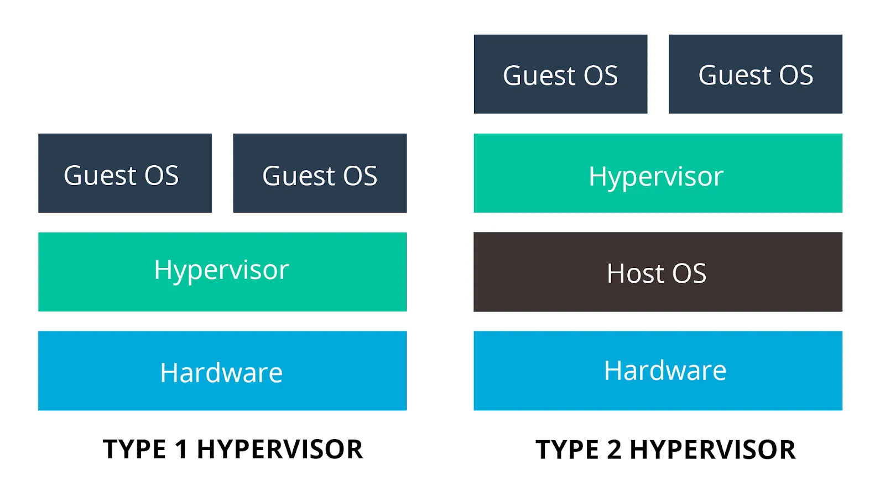

# Introduction to Docker

---

## In the old days


<!-- https://kubernetes.io/docs/concepts/overview/ -->

---

## A lot of drawbacks

-   All software (per client) is installed on a single server with a single OS
    -   A lot of clutter
    -   Difficult to run different versions of certain software
        -   E.g. mariadb:9, mariadb:10, mariadb:11
    -   If the OS or a program crashes, possibility that everything crashes

---

-   Strong coupling between soft- and hardware
    -   Painful to move software or data between hardware
        -   E.g. when a disk is failing
    -   Can't scale hardware to software (dynamically)
        -   E.g. we need more RAM, storage, ...
-   Needs a lot of physical space, electricity

---

-   The hardware is probably underused
    -   Wasting resources == losing money


---

## Solution: virtual machines


<!-- https://kubernetes.io/docs/concepts/overview/ -->

---

## What is a hypervisor?

-   Specialized OS or software on which virtual machines can run virtual machines
-   2 types:
    -   Type 1 (bare metal)
        -   OS between hardware and virtual machines
        -   Most efficient, less wasted resources
    -   Type 2 (hosted)
        -   Program on top of OS
        -   You can run regular program's next to the OS
        -   Often a lot easier

---

### Type 1


---

### Type 2


---

### Comparison



<!-- https://medium.com/teamresellerclub/type-1-and-type-2-hypervisors-what-makes-them-different-6a1755d6ae2c -->

---

We still have a lot of drawbacks:

-   A VM per application creates a lot of overhead
    -   Multiple OS layers (e.g. hypervisor type 2)
-   Creating a VM takes time
    -   E.g. installing the OS each time is cumbersome
-   A VM is large
    -   Uses a lot of disk space
-   A lot more complex

---

## Next solution: containers


<!-- https://kubernetes.io/docs/concepts/overview/ -->

---

## Recap


<!-- https://kubernetes.io/docs/concepts/overview/ -->

---

## When to use what?

-   Virtual machines
    -   E.g. deploying infrastructure
-   Containers
    -   E.g. deploying applications
-   Choose depending on your situation
    -   Each has pro's and cons

---

## Warning


---

## Docker

---

### Images

-   A file containing everything needed to run an application
-   "template", "blueprint", ...
-   Defined by a `Dockerfile`
-   Immutable
-   Layered
-   Create an image if you want to dockerize your application and want others to use it easily

---

### Containers

-   A running instance of an image
-   An isolated environment for your code
    -   Has no knowledge about your system
-   Mutable
-   Use a container if you easily want to use an existing application for which an image exists
    -   You'll probably use containers more often than building images

---

### How are images and containers linked together?

-   E.g. compiled program


---


---


---

### Dockerfile

-   The source code of an image

```docker
# Base image (with tag)
FROM ubuntu:22.04

# Install app dependencies
RUN apt-get update && apt-get install -y python3 python3-pip
RUN pip install flask==2.1.*

# Install app
COPY hello.py /

# Final configuration
ENV FLASK_APP=hello
EXPOSE 8000
CMD flask run --host 0.0.0.0 --port 8000
```

Tutorial: https://docs.docker.com/build/building/packaging/

---

### DockerHub

- up- or download images on https://hub.docker.com/


---

### How it all fits together


<!-- https://blog.octo.com/docker-registry-first-steps -->

---

### In practice

-   "_I have developed an application and want to share it with others_"
    -   Create an image (`Dockerfile`) and upload it to DockerHub
-   "_I want to use an existing application_"
    -   Get their image from DockerHub and create/run a container from that image

---

### Lab: deploy a container

```console
sudo docker run hello-world
```

---


---

-   What images and containers do we have now?
    -   Can you see that container `thirsty_feynman` is created from image `hello-world`?
    -   Tip: Don't forget the `-a` option to see stopped containers!


---

### Port bindings

-   Docker containers are isolated
    -   They cannot "see" or "touch" the host (e.g. your laptop)
-   We can only see what they show on the terminal
    -   Often we want to connect to the application
        -   E.g. a webserver
-   Solution: port bindings
    -   `-p port_on_host:port_in_container`

---

### Lab: Create a port binding

-   Port 8123 on host (e.g. your laptop)
-   Port 80 inside the container (e.g. nginx webserver)
-   Now you can surf to http://localhost:8123
-   When you stop the container, you can't surf to the website anymore.

```console
sudo docker run -p 8123:80 nginx
```


---


---

### Volumes

-   Changes in a container are lost when you kill the container
    -   We want to persist databases, config files, ...
-   We want the container to be able to access our files
    -   E.g. we want nginx to be able to serve the website on the host (e.g. your laptop)
-   Solution
    -   `-v map_on_host:map_in_container`

---

### Lab: create volumes

-   Folder `./website` on host (e.g. your laptop).

    -   Create a website and put it here.

-   Folder `/usr/share/nginx/html` inside the container (e.g. nginx webserver)

    ```console
    sudo docker run -p 8123:80 -v ./website/:/usr/share/nginx/html nginx
    ```

-   Use `ro` if you don't want Docker to be able to edit the files on the host (**r**ead**o**nly).

    ```console
    sudo docker run -p 8123:80 -v ./website/:/usr/share/nginx/html:ro nginx
    ```

---


---

### Tags

-   Tag determines a specific version of an image
-   No tag defaults to the `latest` tag
    -   This could introduce breaking changes during an update!

---

-   Use tags to always use a certain version

    -   E.g.

        ```console
        sudo docker run -p 8123:80 -v ./website/:/usr/share/nginx/html:ro nginx:1.24.0
        ```

-   Tags are sometimes used to differentiate other aspects like the base image
    -   E.g. nginx image based on ubuntu, alpine, ...

---


---


---

## Docker Compose

---

### Why?


<!-- https://www.educative.io/blog/docker-compose-tutorial -->

---

-   Docker on CLI can lead to long commands

    -   E.g.

        ```console
        sudo docker run -p 8123:80 -v ./website/:/usr/share/nginx/html:ro nginx:1.24.0
        ```

-   We want containers to work together in an isolated network
    -   E.g. nginx webserver + database for website.

---

## docker-compose.yml

-   No more configuration on the CLI
-   Everything in `docker-compose.yml`
    -   [Infrastructure as code](https://www.ibm.com/topics/infrastructure-as-code)
    -   Very handy combined with VCS like git!
    -   Regular YAML file

---

### Example 1

```console
sudo docker run -p 8123:80 -v ./website/:/usr/share/nginx/html:ro nginx:1.24.0
```

... becomes ...

```yml
services:
    website:
        image: nginx:1.24.0
        ports:
            - 8123:80
        volumes:
            - ./website/:/usr/share/nginx/html:ro
```

---

-   Use `docker compose up` to initialize all services (containers) and the internal network
    -   Use `--detach` to run them all in the background
-   Use `docker compose down` to kill and destroy the containers

---


---

-   Other handy commands
    -   List running compose projects: `docker compose ls`
    -   List images used by the created containers: `docker compose images`
    -   List containers: `docker compose ps`
        -   `-a` includes stopped containers

---


---

### Example 2

```yml
services:
    database:
        image: mariadb
        environment:
            MARIADB_ROOT_PASSWORD: g8reg6qerg4rg6qr5e1g
            MARIADB_DATABASE: some_db
            MARIADB_USER: some_user
            MARIADB_PASSWORD: s1gqer4gqerqrgg32

    adminer:
        image: adminer
        depends_on:
            - database
        ports:
            - 8123:8080
```

---


---

-   The server name is the same as the service name in `docker-compose.yml`
    -   E.g. `database`
-   The Docker network has it's own DNS
    -   No IP-adresses needed
    -   service name (`database`, `adminer`) are the container DNS names

---

-   Try logging in as root


---

-   Try logging in from your host using a command line client:


-   You can't ...
    -   There is no port mapping for `database`
    -   Normally, your database should not be accessible outside the local network
        -   Best practice for security!

---

-   `database` does not need to map a port
    -   `adminer` can reach it on the local Docker network
-   `adminer` needs to map a port
    -   Host (e.g. your laptop) otherwise can't reach inside the Docker network

---


---

If you really want it (e.g. for development), you can add a port mapping:

```yml
services:
    database:
        image: mariadb
        ports:
            - 3306:3306
        environment:
            MARIADB_ROOT_PASSWORD: g8reg6qerg4rg6qr5e1g
            MARIADB_DATABASE: some_db
            MARIADB_USER: some_user
            MARIADB_PASSWORD: s1gqer4gqerqrgg32

    adminer:
        image: adminer
        depends_on:
            - database
        ports:
            - 8123:8080
```

---


---


---

### Example 3

```yml
services:
    database:
        image: mariadb:11
        volumes:
            - ./database/:/var/lib/mysql
        environment:
            MARIADB_ROOT_PASSWORD: g8reg6qerg4rg6qr5e1g
            MARIADB_DATABASE: wordpress_db
            MARIADB_USER: wordpress_user
            MARIADB_PASSWORD: s1gqer4gqerqrgg32

    wordpress:
        image: wordpress:latest
        depends_on:
            - database
        ports:
            - "8123:80"
        environment:
            WORDPRESS_DB_HOST: database:3306
            WORDPRESS_DB_NAME: wordpress_db
            WORDPRESS_DB_USER: wordpress_user
            WORDPRESS_DB_PASSWORD: s1gqer4gqerqrgg32
```

---

## Remember

-   No IP-adresses needed
    -   E.g. `WORDPRESS_DB_HOST: database:3306`
    -   The Docker network has it's own DNS
    -   service name (`database`, `wordpress`) are the container DNS names

---

-   Be careful with `localhost`
    -   Almost never needed in `docker-compose.yml`
    -   Probably an error!
        -   E.g. `WORDPRESS_DB_HOST: localhost:3306` would look for the database in it's own (`wordpress`) container instead of the `database` container.
        -   Keep in mind: `docker-compose.yml` here virtualized 2 nodes (~ computers) in a network.

---

### Something went wrong

-   View the logs of all services: `docker compose logs`
-   View the logs of one or more services: `docker compose logs <service> ...`
    -   E.g.
        -   `docker compose logs wordpress`
        -   `docker compose logs database`
        -   `docker compose logs wordpress database`
-   Use `--follow` to also see new log entries when created
    -   Similar to `tail -f`

---


---

## You can do a lot more!

- https://docs.docker.com/get-started/overview/
- https://docs.docker.com/compose/
- https://www.linuxserver.io/
- https://github.com/awesome-selfhosted/awesome-selfhosted
- https://kubernetes.io/

---

Notes:

-   https://www.backblaze.com/blog/vm-vs-containers/
-   https://www.atlassian.com/microservices/cloud-computing/containers-vs-vms
-   https://ubuntu.com/blog/containerization-vs-virtualization
-   https://learn.microsoft.com/en-us/virtualization/windowscontainers/about/containers-vs-vm
-   https://www.docker.com/blog/how-to-use-the-official-nginx-docker-image/
-   https://docs.docker.com/get-started/08_using_compose/
