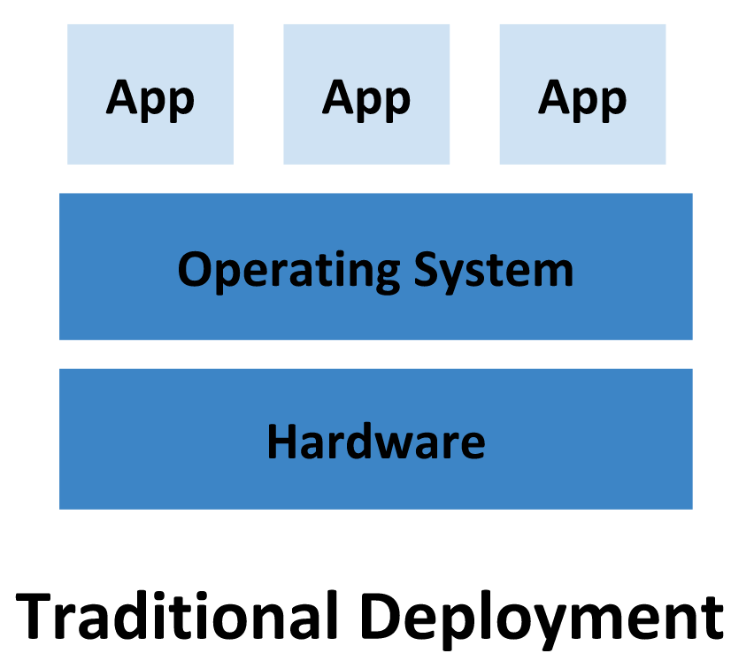
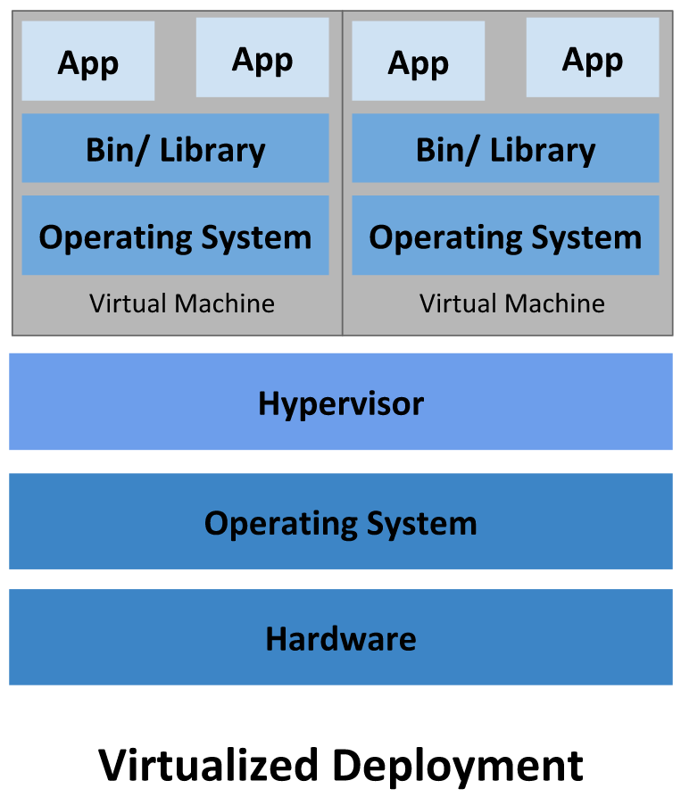

# Introduction to Docker

---

## In the old days

<!-- https://kubernetes.io/docs/concepts/overview/ -->

---

A lot of drawbacks:

-   TODO

---

## Solution: virtual machines

<!-- https://kubernetes.io/docs/concepts/overview/ -->

---

## What is a hypervisor?

---

### 2 types

<!-- https://medium.com/teamresellerclub/type-1-and-type-2-hypervisors-what-makes-them-different-6a1755d6ae2c -->

---

 

---
We still have a lot of drawbacks:

-   TODO

---

## Next solution: containers

<!-- https://kubernetes.io/docs/concepts/overview/ -->

---

## Recap

<!-- https://kubernetes.io/docs/concepts/overview/ -->

---

## When do we use what?

---

## Docker

---

### What are images?

---

### DockerHub

---

### What are containers?

---

### How it all fits together

<!-- https://blog.octo.com/docker-registry-first-steps -->

---

### What are port bindings?

---

### What are volumes?

---

## Docker Compose

---

Notes:

-   https://www.backblaze.com/blog/vm-vs-containers/
-   https://www.atlassian.com/microservices/cloud-computing/containers-vs-vms
-   https://ubuntu.com/blog/containerization-vs-virtualization
-   https://learn.microsoft.com/en-us/virtualization/windowscontainers/about/containers-vs-vm
